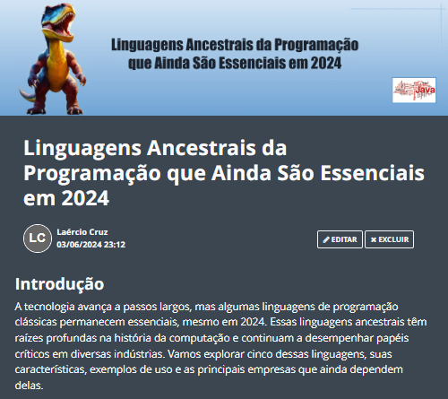

    

-------
# Projeto artigo técnico gerado por I.A.s

Projeto com o objetivo de gerar um artigo técnico com um layout rico, leitura agradável e com foco em promover sua autoridade técnica.

<a href="https://web.dio.me/articles/linguagens-ancestrais-da-programacao-que-ainda-sao-essenciais-em-2024?back=%2Farticles&page=1&order=oldest" title="View PDF now"> 📕Clique aqui para ler o artigo</a>

## 💻 Tecnologias utilizadas no projeto

- [ChatGPT](https://chat.openai.com/) - para título e conteúdo
- [Lexica.art](https://lexica.art/) - para gerar imagens
- [Google Apresentações](hhttps://docs.google.com/presentation/u/0/) - Para formatação de banners e Layouts

## 📄 Prompts e ferramentas

ChatGPT：

|   Ação   | prompt                                                                                                                                                                                                                                                                         |
| :------: | ------------------------------------------------------------------------------------------------------------------------------------------------------------------------------------------------------------------------------------------------------------------------------ |
|  título  | Crie 10 headlines para nomes de artigos sobre: linguagens de programação antigas ainda muito utilizadas atualmente                                                                                                                                                                                                  |
| conteúdo | Escreva um artigo sobre o assunto: Linguagens Ancestrais da Programação que Ainda São Essenciais em 2024 {REGRAS} > Faça uma introdução sobre o tema > Liste as 5 principais linguagens > Uma breve descrição com no máximo 5 linhas para cada linguagem > 10 características principais de cada linguagem > Exemplos de 5 principais comandos em apenas uma linha > Cite as principais empresas que utilizam cada linguagem > Explique de maneira desccontraída > Faça uma conclusão sobre o tema > Crie subtitulos para cada bloco |

Lexica.art：

- No léxica utilizamos o acervo público de imagens geradas por outras pessoas.

## ✨ Features

- Conteúdo gerado via ChatGPT
- Imagens do acervo público geradas via Lexica.art

## 📚 Materiais

- prompts utilizados

## 🛠️ Instruções de execução

Utilize os prompts acima nas ferramentas sugeridas para gerar o material base e utilize uma ferramenta de edição de documentos como power point, libreoffice , indesign para diagramação, o passo a passo em vídeo pode ser conferido na plataforma da [DIO](https://dio.me).

## 👨‍💻 Expert

    
&nbsp&nbsp&nbspLaércio Cruz 
    &nbsp&nbsp&nbsp
    <a href="https://github.com/laercioscruz">
    GitHub</a>&nbsp;|&nbsp;
    <a href="https://www.linkedin.com/in/la%C3%A9rcio-silva-da-cruz-87a62424/">LinkedIn</a>
&nbsp;|&nbsp;

  

---
